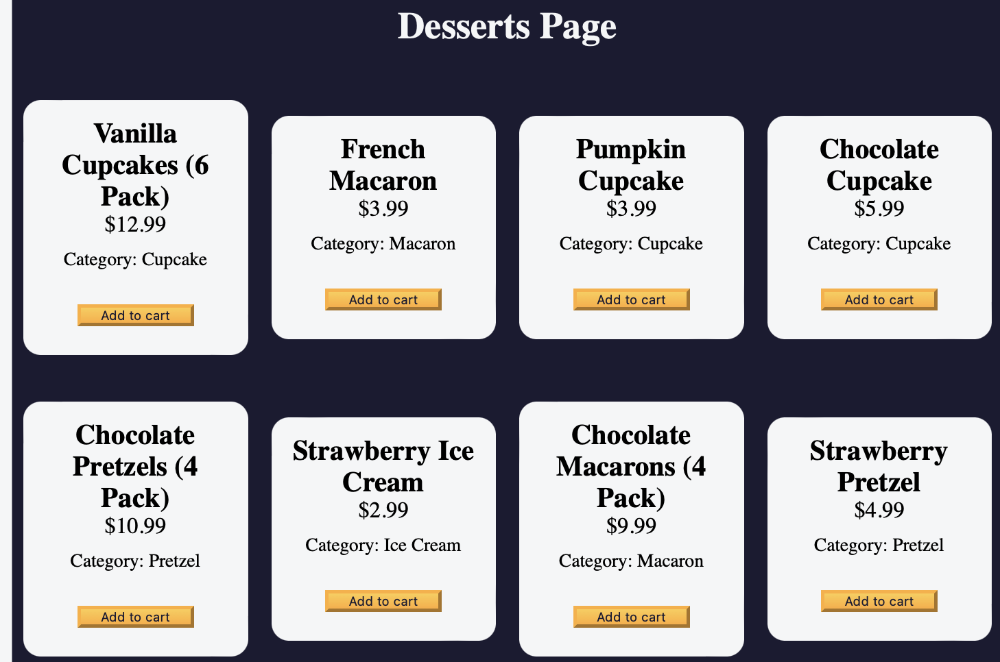

# Javascript

#### The ultimate guide to *JavaScript Algorithms and Data Structures (Beta)* 

//Insert Summarised Introduction/Description

> *INSERT CALLOUT:)*

## Resources

Here are some links you might find helpful!

* **freecodecamp** -> https://www.freecodecamp.org/learn/javascript-algorithms-and-data-structures-v8/

## Chapter 1

### Learn Introductory JavaScript by Building a Pyramid Generator
### Learn Basic JavaScript by Building a Role Playing Game

- What is console.log()
  - 'console' is the object family, '.log()' is a method.
  - It is method that allows your to print out to the console.
  - It is apart of the console family and is very useful for debugging your code, inspecting variables and commonly used by all developers.

- Define Let, Var, Const.

- What is an array? 
  - An array is and holds a collection of items within '[]'. These items can be be anything ranging from strings to objects;

An array is a non-primitive data type that can hold a series of values. Non-primitive data types differ from primitive data types in that they can hold more complex data. Primitive data types like strings and numbers can only hold one value at a time.

Arrays are denoted using square brackets ([]). Here is an example of a variable with the value of an empty array:

### Learn Form Validation by Building a Calorie Counter
### Learn Basic String and Array Methods by Building a Music Player
### Learn the Date Object by Building a Date Formatter
### Build a Palindrome Checker Project

## Chapter 2

### Learn Modern JavaScript Methods by Building Football Team Cards
### Learn localStorage by Building a Todo App

* **Put stuff in the box:** `localStorage.setItem("key", "value")`  
  - Give it a label (`key`) and the thing to remember (`value`).

* **Find stuff in the box:** `localStorage.getItem("key")`  
  - Look up by label, returns what's inside (as text).

* **Take stuff out of the box:** `localStorage.removeItem("key")`  
  - Find by label and toss it away.

**Remember:** Everything in the box is text, convert it back if needed! 

  - Step 48 (The order of = variables)
    - [x + y]  = 8
    - [x + y]  = 8

  Incorrect Order (Reasoning):

In the previous order (currentTask.title = titleInput.value;, etc.), we were trying to set the properties of the currentTask object based on unmodified input field values. This might lead to unexpected behavior if the currentTask object already had some values.

Correct Order (Explanation):

The current order (titleInput.value = currentTask.title;, etc.) works because it sets the input field values based on the existing currentTask object properties. This ensures the input fields display the current data of the task:

We first access the property of the currentTask object (e.g., currentTask.title).
This retrieves the current title, date, or description of the task.
Then, we assign that retrieved value to the value property of the corresponding input field (e.g., titleInput.value).
By doing this, we're effectively populating the input fields with the data from the currentTask object, making it ready for editing.

Summary:

The correct order prioritizes displaying the current task information in the input fields.
The previous order attempted to update the currentTask object with potentially outdated input field values.

Incorrect Order (Mistake):

You try to copy from your scratch paper to your answer sheet without checking what's already written there (set currentTask properties based on unmodified input values).
If there were any mistakes on your scratch paper (outdated input field values), you'd copy those mistakes to your answer sheet (unexpected behavior if currentTask already has values).
Correct Order (Solution):

You first look at your answer sheet (get value from currentTask object).
See what's already written there (retrieve current title, date, or description).
Then you copy the correct information from your scratch paper to the corresponding blank on your answer sheet (set input field values based on currentTask properties).
This ensures your answer sheet has the latest information (displays current data of the task).
Summary:

The correct order makes sure you copy the most recent answers (current task information) to your clean sheet (input fields), avoiding any mistakes from outdated information.

### Learn Recursion by Building a Decimal to Binary Converter
### Build a Roman Numeral Converter ProjectCertification Project

## Chapter 3

### Learn Regular Expressions by Building a Spam Filter
### Learn Basic Algorithmic Thinking by Building a Number Sorter
### Learn Advanced Array Methods by Building a Statistics Calculator
### Learn Functional Programming by Building a Spreadsheet
### Build a Telephone Number Validator ProjectCertification Project

## Chapter 3

### Learn Basic OOP by Building a Shopping Cart
 

 `this` keyword

 The this keyword is necessary for this.items.push(product) because it refers to the current object instance. Here's a breakdown:

this keyword: Inside a method of a class, this refers to the current object instance. In this case, the addItem method is a method within the ShoppingCart class.

this.items: This refers to the items property defined within the ShoppingCart class constructor. This property holds an array to store the items in the shopping cart.

.push(product): The push method is used on arrays to add elements to the end. Here, we are adding the product (found using find) to the items array.

Without this, the code would try to add the product to a variable named items that might not exist in the current scope. Using this.items ensures the product is added to the intended array, which is the items property of the current ShoppingCart object.

Here's an analogy: Imagine ShoppingCart as a shopping cart object. The items property is like the basket of the cart where you store items. The this keyword helps identify the specific cart's basket (the current object instance's items property) where you want to add the product.

Absolutely! Here's the cliff note version for your notes:

**`this` in ShoppingCart:**

* `this` refers to the current shopping cart object.
* `.items` accesses the shopping cart's item list.
* **Without `this`:** Trying to add product to a non-existent variable.
* **With `this.items`:** Adding product to the correct item list of the current cart.
* Think of `this` as identifying the specific cart (object) you're working with.

<<<<<<< HEAD
 s
=======
 sw
>>>>>>> 9a6815d (added new files)
### Learn Intermediate OOP by Building a Platformer Game, Not started
### Learn Intermediate Algorithmic Thinking by Building a Dice Game
### Build a Cash Register ProjectCertification Project

## Chapter 4

### Learn Fetch and Promises by Building an fCC Authors Page
### Learn Asynchronous Programming by Building an fCC Forum Leaderboard
### Certification Project
### Build a Pokémon Search App ProjectCertification Project